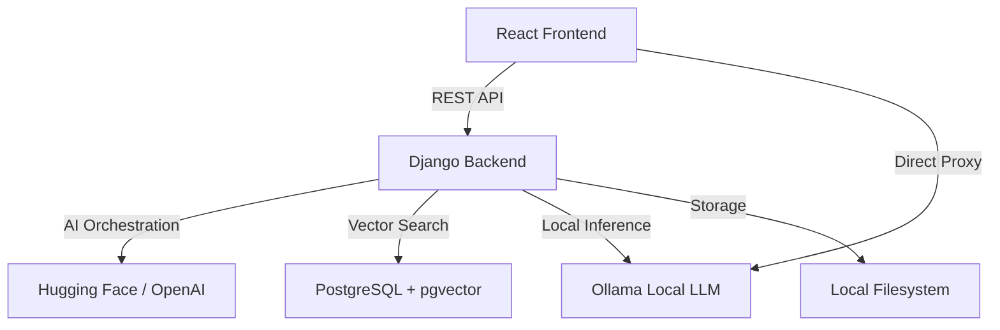

# 🤖 TECHBRO AI: The Ultimate Full-Stack Study Buddy


TECHBRO AI is a state-of-the-art, full-stack application designed to revolutionize the way students interact with their study materials. By leveraging advanced local and remote AI models, it transforms dense notes, complex PDFs, and even images into interactive study tools like summaries, quizzes, and flashcards.

---

## 🚀 Key Features

### 💡 AI Explainer (Study Chatbot)
Stuck on a difficult concept? Our AI Study Buddy provides clear, analogy-rich explanations.
- **Tech-Focused Suggestions**: Ready-to-go questions on Big O notation, Event Loops, TCP/UDP, and more.
- **Hybrid Backend**: Seamlessly toggles between a custom Django backend and a local Ollama proxy for maximum availability.

### 📄 Note Summarizer
Upload PDFs, images, or paste text to get instant, high-quality summaries.
- **Multi-Format Support**: Handles .pdf, .jpg, .png, and plain text.
- **Vision Integration**: Uses Qwen2.5-VL for accurate text extraction from images.

### 🎴 Flashcard Master
Transform any topic or set of notes into a deck of interactive flashcards.
- **AI-Powered Generation**: Automatically creates questions and answers based on your specific content.
- **Lazy Image Loading**: Enhances flashcards with relevant AI-generated imagery for better retention.

### ✅ Quiz Master
Test your knowledge with automatically generated quizzes.
- **Real-Time Feedback**: Get instant scores and explanations for every answer.
- **Context-Aware**: Quizzes are tailored to the exact difficulty and scope of your study materials.

### 📊 Performance Dashboard
Monitor your learning journey with data-driven insights.
- **Study Time Tracking**: High-precision tracking of time spent per feature.
- **Activity Visualization**: Weekly BarCharts showing your study habits in hours and minutes.

---

## 🏗️ Technical Architecture

TECHBRO AI is built with a modern, scalable architecture designed for high performance and AI efficiency.



### Hybrid RAG (Retrieval-Augmented Generation)
- **Vector Database**: Uses `pgvector` for efficient similarity searches across your indexed notes.
- **Intelligent Context**: Automatically injects relevant snippets from your previous notes into AI conversations for personalized assistance.

---

## 🛠️ Stack & Infrastructure

- **Frontend**: React 19, Vite, Tailwind CSS, Recharts, Framer Motion.
- **Backend**: Django 5.2+, Django REST Framework, PostgreSQL + pgvector.
- **AI Models**:
  - **Text**: Llama 3.2 (via Ollama)
  - **Vision**: Qwen2.5-VL / Llama 3.2 Vision
  - **Embeddings**: Nomic-Embed-Text
- **DevOps**: Docker & Compose, GitHub Actions CI/CD, Pre-commit Hooks (Black, ESLint).

---

## 🚦 Installation & Setup

### Prerequisites
- **Docker Desktop** (with WSL2 backend for Windows)
- **Ollama** installed on the host machine
- **Python 3.11+** and **Node.js 22+** (for non-docker development)

### Quick Start (Docker)
1. **Clone the Repo**:
   ```bash
   git clone https://github.com/armanraymagit/TECHBRO_AI.git
   cd TECHBRO_AI
   ```
2. **Environment Setup**:
   Copy `.env.docker` to `Django/djangoLLM/.env` and fill in necessary API keys.
3. **Launch**:
   ```bash
   docker compose up --build
   ```
   Access at `http://localhost:3000`

### Local Development Setup

#### Backend
```bash
cd Django/djangoLLM
python -m venv env
./env/Scripts/Activate.ps1 # Windows
pip install -r requirements.txt
python manage.py migrate
python manage.py runserver
```

#### Frontend
```bash
cd techbroai
npm install
npm run dev
```

---

## ⚙️ Environment Variables

Required variables in `Django/djangoLLM/.env`:
- `OLLAMA_HOST`: `http://host.docker.internal:11434` (Docker) or `http://127.0.0.1:11434` (Local)
- `HUGGINGFACE_API_KEY`: For remote vision/extraction model fallback.
- `POSTGRES_DB`, `POSTGRES_USER`, `POSTGRES_PASSWORD`: Database credentials.

---

## 🧪 CI/CD & Quality Control

TECHBRO AI maintains high code quality through automated pipelines:
- **Linting**: ESLint for JS/TS, Black for Python.
- **Testing**: Vitest for frontend, Django Test for backend.
- **Pipeline**: GitHub Actions (`devops.yml`) runs on every push to ensure builds are stable.
- **Deployment**: Automatic Docker image builds and deployment via `deploy.yml`.

---

## 📄 License

> [!IMPORTANT]
> This project is licensed under a **Private Proprietary License**.
> Access and use are restricted. See the [LICENSE](./LICENSE) file for the full legal terms.

Author: **arman**

© 2026 TECHBRO AI. All Rights Reserved.

